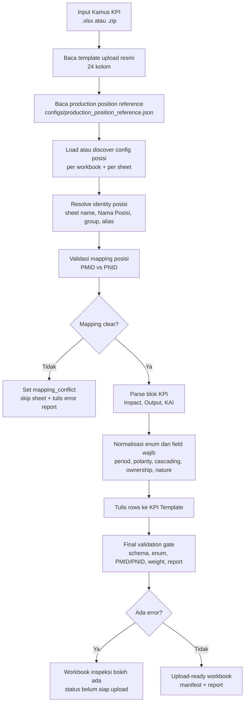
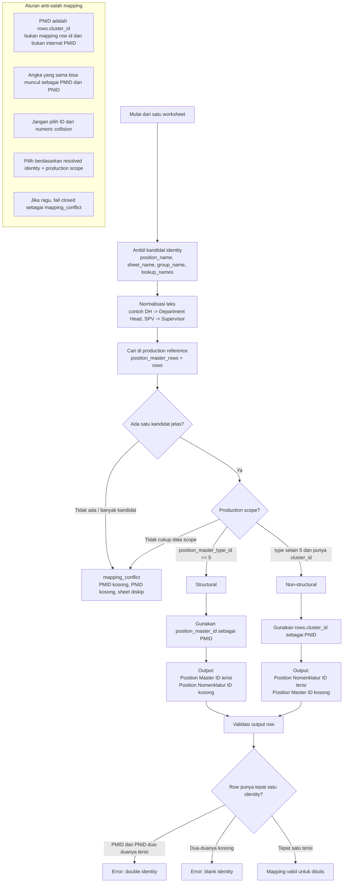
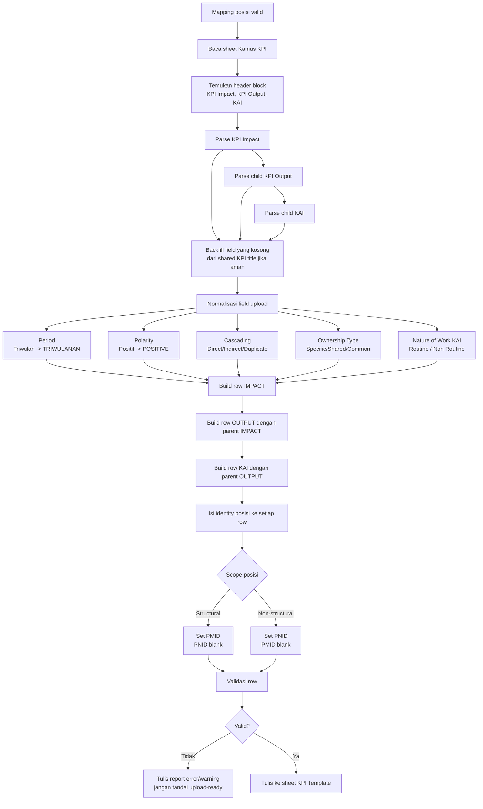
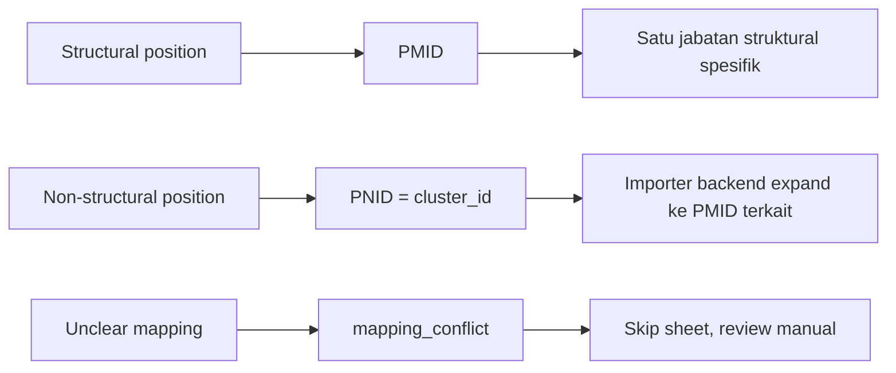

# Diagram Logic Ideal KPI Converter

Dokumen ini memvisualisasikan logic ideal converter KPI bulk upload, terutama pemetaan posisi dan penulisan kamus KPI ke template upload.

## 1. Alur Besar Converter

## 2. Logic Pemetaan Posisi

## 3. Logic Penulisan Kamus ke Template Upload

## 4. Mental Model Singkat

## Prinsip Desain

1. `configs/production_position_reference.json` adalah source of truth offline.
2. `position_master_type_id == 5` berarti structural.
3. PNID selalu `rows[].cluster_id`.
4. Structural menulis PMID saja.
5. Non-structural menulis PNID saja.
6. Converter tidak boleh menulis PMID dan PNID sekaligus.
7. Converter tidak boleh menulis row tanpa PMID/PNID.
8. Mapping yang ambigu harus menjadi `mapping_conflict`, bukan ditebak.
