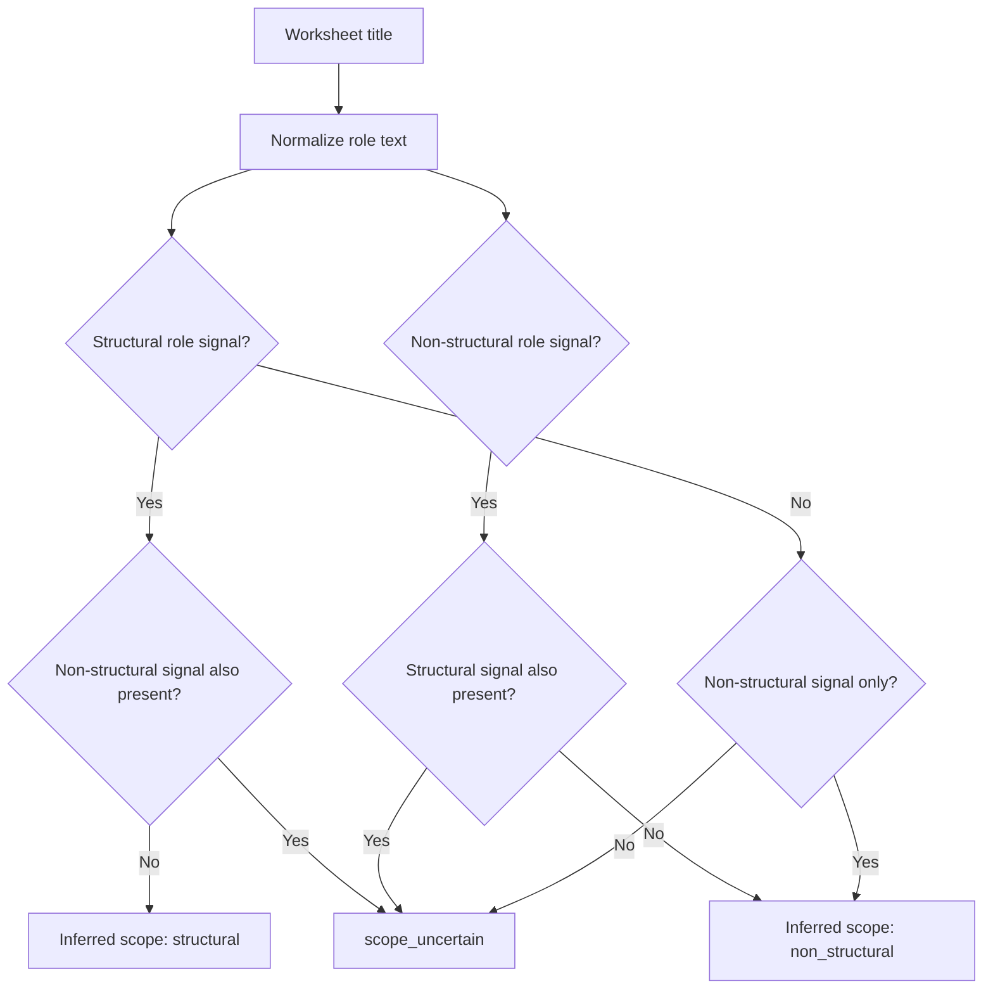
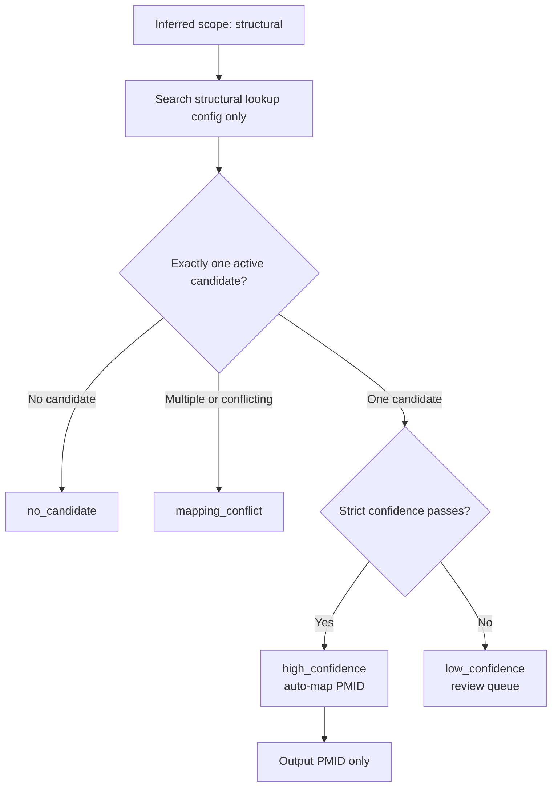
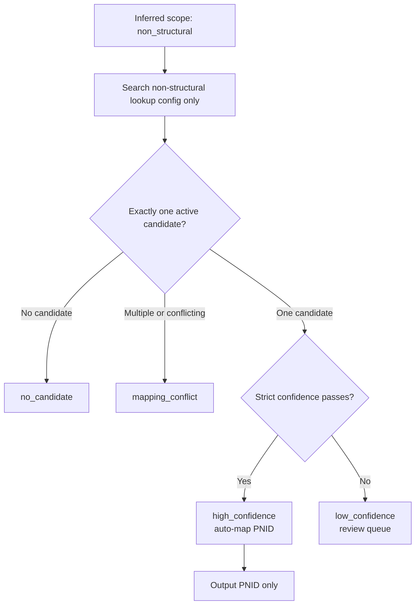
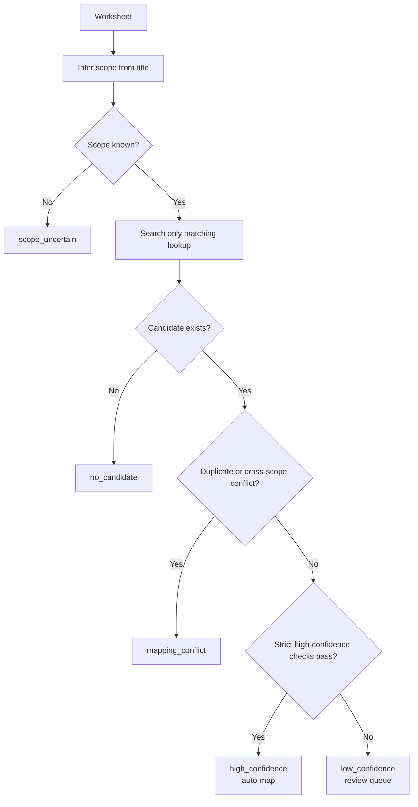

# Strict Position Mapping Logic Specification

This document defines the target design for KPI converter position mapping. It is specification-only. It does not describe an implemented code change yet.

## 1. Goal

The converter must map every source worksheet to the correct upload identity before writing KPI rows:

- Structural worksheet -> `Position Master ID (Required)` / PMID only.
- Non-structural worksheet -> `Position Nomenklatur ID` / PNID only.
- Unclear worksheet -> reviewer report only, no upload rows.

The converter must decide worksheet scope first, then search only the matching active lookup dataset. This avoids choosing between PMID and PNID by numeric collision.

## 2. Lookup Datasets

Generate and use two separated active lookup datasets.

| Dataset | Scope | Key | Source concept | Upload output |
| --- | --- | --- | --- | --- |
| Structural lookup config | structural | `position_master_id` | active structural position master | PMID |
| Non-structural lookup config | non_structural | `cluster_id` | active position nomenclature mapping | PNID |

The converter must not use one mixed lookup table as the primary decision source. Mixed data can still exist in the exported production reference for audit, but automatic mapping must happen against the scope-specific lookup after worksheet scope inference.

### Required Structural Fields

- `position_master_id`
- `position_name`
- `position_master_type_id`
- `group_master_id`
- `group_name`
- `company_id`
- `company_name`
- `company_code`
- `active_variant_count`
- `active_employee_count`
- normalized lookup keys

### Required Non-structural Fields

- `cluster_id`
- `cluster_label`
- `position_master_id`
- `position_name`
- `position_master_type_id`
- `group_master_id`
- `group_name`
- `company_id`
- `company_name`
- `company_code`
- `active_variant_count`
- `active_employee_count`
- normalized lookup keys

## 3. Active Position Rule

A row is eligible for either lookup dataset only when all conditions are true:

1. Position master is not deleted.
2. Current date is within position master start/end period.
3. Organization/group/company are not deleted.
4. Current date is within organization/group/company start/end period.
5. There is at least one active position variant for the position.
6. There is at least one active employee assigned to an active position variant.

Product note: this rule excludes vacant structural positions. If vacant structural roles must receive KPI templates later, add an explicit `include_vacant_structural=true` export mode. Do not silently include vacant roles in the default active lookup.

## 4. Worksheet Scope Inference

The converter must infer worksheet scope from worksheet title before looking up a PMID or PNID.

### Structural Role Signals

Treat the worksheet as structural when the normalized worksheet title contains one structural signal and no conflicting non-structural signal:

- `group head`
- `department head`
- `division head`
- `div head`
- `manager`
- `regional manager`
- abbreviations: `gh`, `dh`, `depthead`, `divhead`, `mgr`

### Non-structural Role Signals

Treat the worksheet as non-structural when the normalized worksheet title contains one non-structural signal and no conflicting structural signal:

- `officer`
- `auditor`
- `analyst`
- `specialist`
- `staff`
- common typo or abbreviation variants already normalized by the converter, such as `oficer`

### Scope Outcome

| Condition | Inferred scope |
| --- | --- |
| structural signal only | `structural` |
| non-structural signal only | `non_structural` |
| both structural and non-structural signals | `scope_uncertain` |
| no role signal | `scope_uncertain` |
| generic title only, for example `Kamus KPI Bagian` | `scope_uncertain` |

`scope_uncertain` must not produce upload rows. It goes to the mapping report.

## 5. Structural PMID Lookup

When inferred scope is `structural`, search only the structural lookup config.

Automatic mapping is allowed only when:

1. Exactly one active structural candidate matches.
2. Candidate `position_master_type_id` is structural.
3. Candidate has `active_variant_count >= 1`.
4. Candidate has `active_employee_count >= 1`.
5. Title match is exact or very strong.
6. Company/group context matches when source context is available.
7. Runner-up candidate is not close.

Output invariant:

- Fill `Position Master ID (Required)` with PMID.
- Leave `Position Nomenklatur ID` blank.

## 6. Non-structural PNID Lookup

When inferred scope is `non_structural`, search only the non-structural lookup config.

Automatic mapping is allowed only when:

1. Exactly one active non-structural candidate matches.
2. Candidate has valid `cluster_id`.
3. Candidate has `active_variant_count >= 1`.
4. Candidate has `active_employee_count >= 1`.
5. Title match is exact or very strong.
6. Company/group context matches when source context is available.
7. Runner-up candidate is not close.

Output invariant:

- Fill `Position Nomenklatur ID` with PNID / `cluster_id`.
- Leave `Position Master ID (Required)` blank.

## 7. Strict Confidence Labels

Use strict-only confidence. Only `high_confidence` may auto-map.

| Label | Meaning | Upload row allowed? | Reviewer action |
| --- | --- | --- | --- |
| `high_confidence` | Scope is clear and exactly one active candidate passes all strict checks. | Yes | Optional audit only |
| `low_confidence` | A candidate exists, but at least one strict check is weak. | No | User reviews first |
| `scope_uncertain` | Worksheet title cannot safely determine structural vs non-structural. | No | User decides scope |
| `no_candidate` | Scope is known, but no active candidate exists in the matching lookup. | No | User checks source title or active reference |
| `mapping_conflict` | Conflicting signals, duplicate strong candidates, or cross-scope disagreement. | No | User chooses or fixes mapping |

### Numeric Thresholds

Use existing candidate scoring only as supporting evidence. The strict labels must apply these thresholds:

- `high_confidence`: best score `>= 0.90`, candidate count `= 1`, and runner-up gap `>= 0.15`.
- `low_confidence`: best score `>= 0.65` but any high-confidence condition fails.
- `no_candidate`: best score `< 0.65` or no candidate in the matching lookup.
- `mapping_conflict`: two or more candidates score `>= 0.80` with runner-up gap `< 0.15`, or candidates disagree on scope.
- `scope_uncertain`: scope inference fails before candidate scoring.

If a worksheet has `scope_uncertain`, do not search both lookup configs to force a best guess.

## 8. Mapping Report Requirements

Every worksheet must have one mapping report row, including successful high-confidence mappings.

Required columns:

- `Source Workbook`
- `Worksheet`
- `Raw Worksheet Title`
- `Normalized Worksheet Title`
- `Inferred Scope`
- `Confidence Label`
- `Confidence Reason`
- `Candidate PMID`
- `Candidate PNID`
- `Candidate Title`
- `Candidate Group`
- `Candidate Company`
- `Candidate Company Code`
- `Candidate Score`
- `Runner-up Scope`
- `Runner-up PMID`
- `Runner-up PNID`
- `Runner-up Title`
- `Runner-up Score`
- `Active Variant Count`
- `Active Employee Count`
- `Active Employee Name`
- `Active Employee NIPP`
- `Recommended Action`

Recommended actions:

- `high_confidence`: `No action required; auto-mapped.`
- `low_confidence`: `Review candidate before allowing upload rows.`
- `scope_uncertain`: `Decide whether worksheet is structural or non-structural.`
- `no_candidate`: `Check active reference or source worksheet title.`
- `mapping_conflict`: `Choose one candidate or create manual override.`

## 9. Compatibility Rules

- Existing config values can be used as manual overrides only after they pass the new scope-specific active lookup validation.
- A manual structural override must point to an active structural PMID.
- A manual non-structural override must point to an active PNID / `cluster_id`.
- Config must never contain both final PMID and final PNID for the same worksheet.
- Low-confidence, scope-uncertain, no-candidate, and mapping-conflict worksheets must not produce upload rows.

## 10. Acceptance Criteria

The future implementation is acceptable when:

1. Structural and non-structural lookup configs are generated separately.
2. Worksheet scope is inferred before candidate lookup.
3. Active lookup rows require active position master, active organization/company, active variant, and active employee.
4. Only `high_confidence` mappings are written to upload rows automatically.
5. Low-confidence mappings are listed clearly for user review.
6. `scope_uncertain` worksheets are listed separately and never auto-mapped.
7. Every generated upload row has exactly one identity: PMID or PNID.
